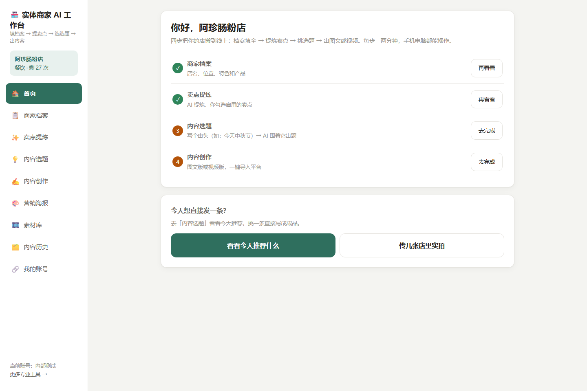
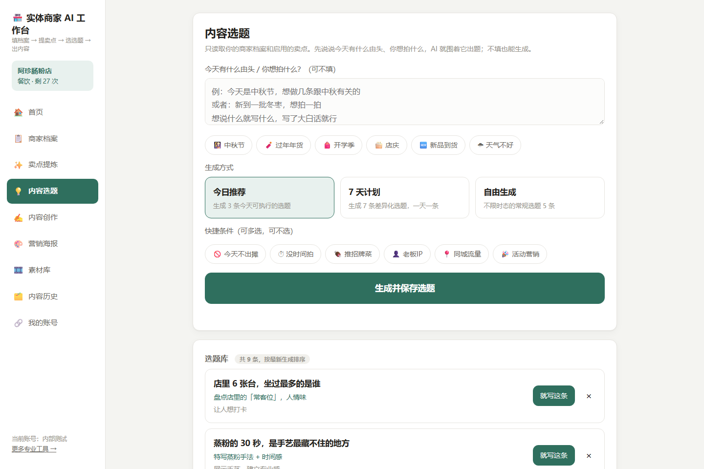
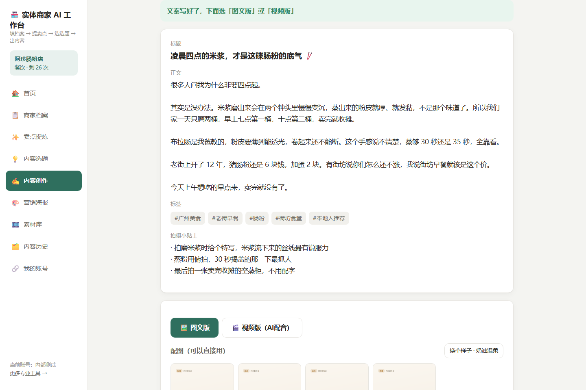
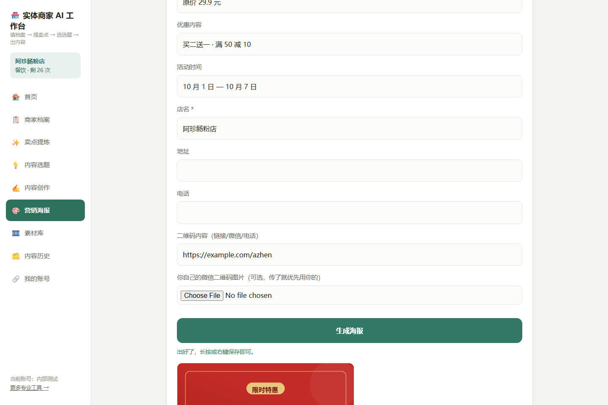
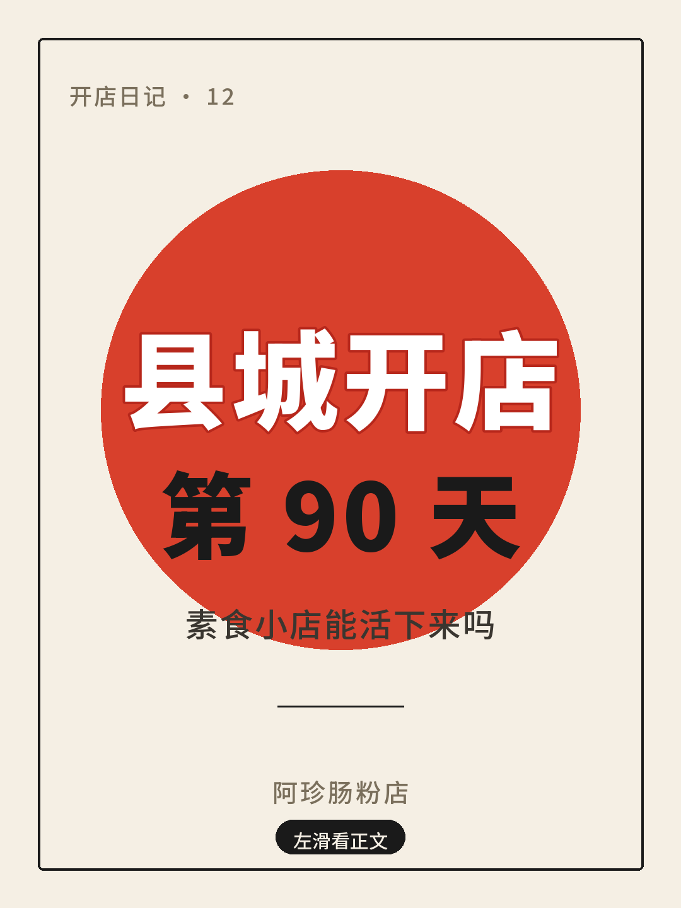
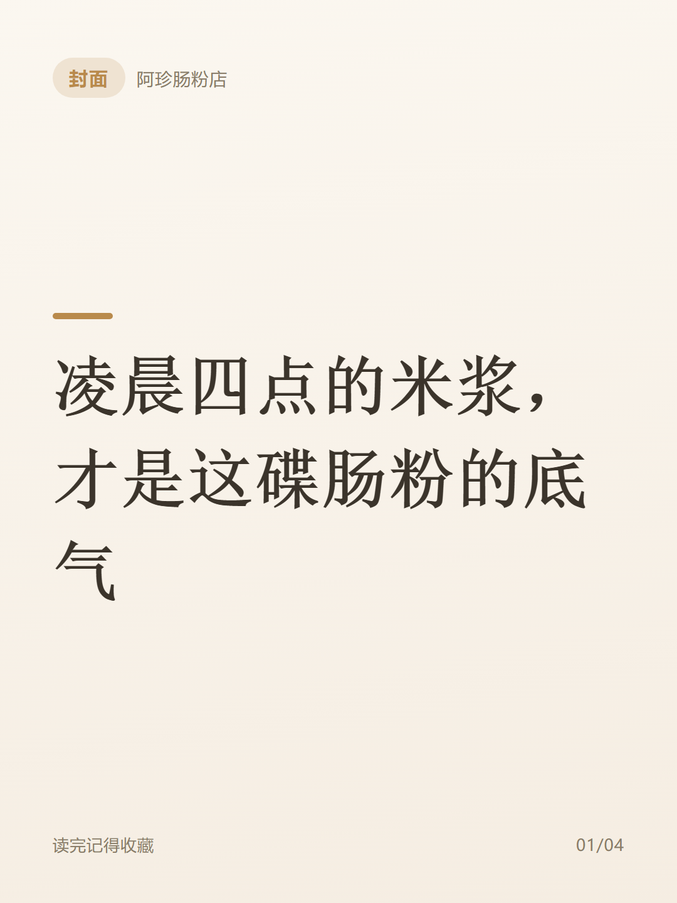
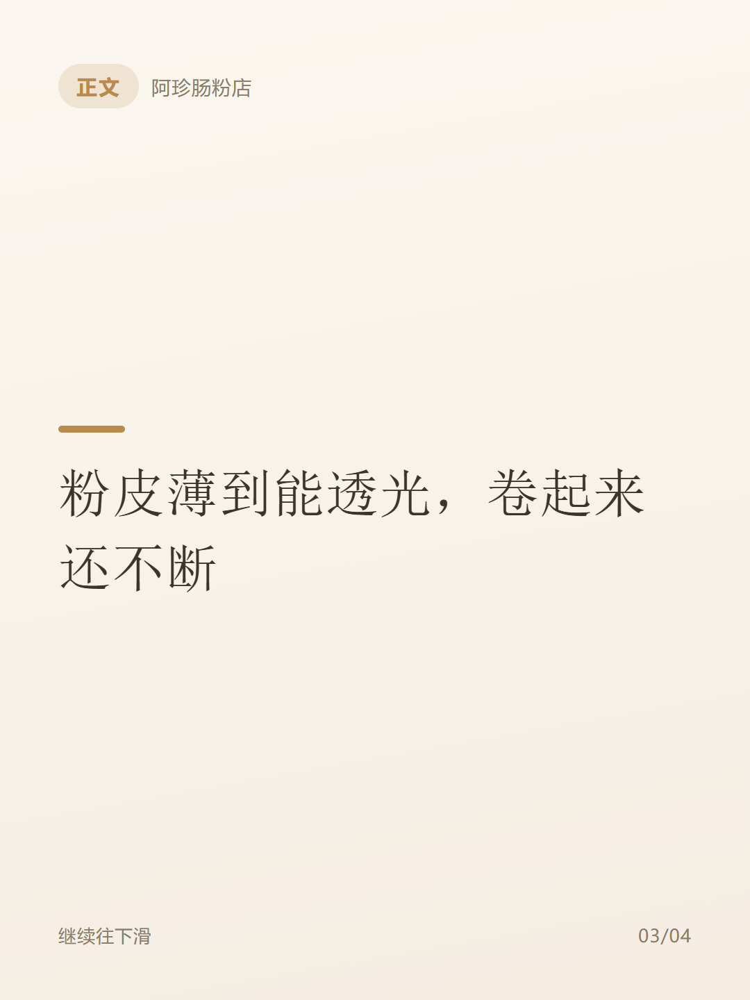
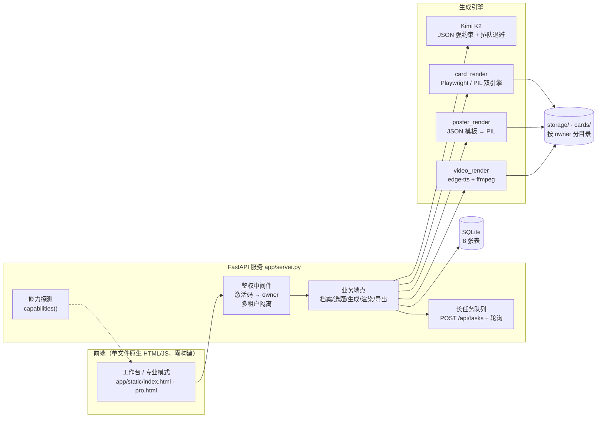

<div align="center">

# merchant-ai-studio · 实体商家 AI 内容工作台

**给县城/社区实体店老板用的「小红书 + 抖音」内容代运营工作台。**
填一次店铺档案 → AI 出选题、写文案 → 自动出配图卡片与营销海报 → 合成 AI 配音营销视频 → 导出成品或一键代发。

<sub>FastAPI · SQLite · Pillow · edge-tts · ffmpeg · 单文件原生前端（零构建）</sub>

[](https://www.python.org/)
[](https://fastapi.tiangolo.com/)
[](https://sqlite.org/)
[](https://python-pillow.org/)
[](LICENSE)

</div>

---

## English Summary

**merchant-ai-studio** is a content-marketing workspace for small brick-and-mortar shops in China
(breakfast stalls, neighborhood restaurants, kindergartens). A shop owner fills in a one-page profile
once; the system then generates topic ideas, Xiaohongshu/Douyin copy, illustrated cards, marketing
posters and a fully synthetic voice-over video — all from a single FastAPI service with no frontend
build step.

Built solo, end to end: multi-tenant licensing & login, prompt orchestration, a pure-PIL poster
templating engine, an audio/video pipeline (edge-tts + ffmpeg), capability probing with graceful
degradation, and E2E tests. See [Technical Highlights](#技术难点与取舍) for the engineering decisions.

---

## 界面

<table>
<tr>
<td width="50%"><br><sub><b>工作台首页</b>：四步引导 + 店铺卡 + 配额</sub></td>
<td width="50%"><br><sub><b>内容选题</b>：老板写的「由头」是一等公民</sub></td>
</tr>
<tr>
<td width="50%"><br><sub><b>内容创作</b>：一条成品 + 自动出配图卡片</sub></td>
<td width="50%"><br><sub><b>营销海报</b>：选模板 → 填字段 → 出图（纯 PIL）</sub></td>
</tr>
</table>

### 出图能力示例（全部由本项目的 PIL 引擎渲染，非设计稿）

| 营销海报：限时大促 | 营销海报：节日祝福 | 小红书封面：大字报 |
|---|---|---|
|  |  |  |

配图卡片（小红书图文笔记的 3 张一套，含封面/内容/结尾）：

<p>



</p>

---

## 核心功能

| 模块 | 说明 |
|---|---|
| **店铺档案** | 老板用大白话填「特色产品 / 客人是谁 / 雷区」，一次录入反复复用 |
| **卖点提炼** | AI 从档案里提炼 4-6 条卖点，老板勾选启用；启用的卖点注入后续所有生成 |
| **内容选题** | 支持「今日推荐 / 7 天计划 / 自由生成」三种模式，可勾选快捷条件（今天不出摊、没时间拍、推招牌菜…）；**老板写的一句由头（如「今天降温」）优先级高于通用套路** |
| **内容创作** | 一条成品文案（标题 / 正文 / 标签 / 拍摄提示），图文与视频共用同一份文案 |
| **配图卡片** | 3 种风格（奶油温柔 / 瑞士极简 / 手账贴纸），出 1080×1440 PNG；有浏览器走 Playwright 渲染，没有自动降级纯 PIL |
| **营销海报** | 8 个 JSON 模板（4 营销 + 4 封面版式），纯 PIL 渲染，含价格排版、二维码、字号自适应 —— **加模板 = 加一个 JSON 文件，零代码** |
| **AI 配音视频** | 素材图/视频 → AI 分镜 → edge-tts 配音 → PIL 字幕条 → ffmpeg 合成 1080×1920 竖版 mp4 |
| **质量质检** | 合规 + 质量五维审核、选题七维评分、一稿多发（抖音口播/公众号/微博）、月度排期表 |
| **多租户与授权** | 激活码 + 手机号一码一人登录、配额、按用户隔离数据与文件目录 |
| **导出与代发** | 一键导出成品（配图 zip + 文案 / mp4 直链）；本机装有浏览器发布脚本时可扫码登录后一键代发 |

---

## 架构



**分层思路**：提示词、渲染引擎、业务端点三层解耦 —— `prompts/*.md` 是提示词的唯一权威来源，
`*_render.py` 是可独立测试的纯函数引擎，`server.py` 只负责编排与权限。

---

## 技术难点与取舍

这些是实际写的时候踩过并解决掉的问题，也是这个项目最值得看的部分：

**① 让 AI 稳定输出可渲染的结构化数据**
`kimi-k2.6` 只接受 `temperature=1`，且**组织级并发 = 1** —— 第二个并发请求必定 429。
做法：进程内请求锁把调用排成队（比让用户看到「限流失败」体验好），叠加指数退避（5s/15s/30s）兜住偶发限流；
强制 `response_format=json_object`，端点不支持时自动退回普通模式再解析。
长 JSON（排期表 12×9 字段）实测 >180s，为此把该端点超时单独放宽到 420s。

**② 长任务必须异步化**
云端网关 60s 掐断同步请求，视频合成动辄 1-3 分钟。
做法：AI 生成与视频合成统一走 `POST /api/tasks` 提交 + `GET /api/tasks/{id}` 轮询，前端显示进度；本地同步端点保留，两套并存。

**③ 海报模板引擎：让「加模板」不需要写代码**
`poster_render.py` 把模板描述成 JSON（背景渐变 + 元素数组：text / badge / price / image / qrcode / rect / circle / line），
引擎负责字号自适应、标点避行首换行、圆角图、二维码生成。
代价是要自己处理排版细节，收益是**运营改模板不用碰代码**，且纯 PIL 在无浏览器的服务器上也能出图。

**④ 中文字体：既要好看又要能进仓库**
服务器上通常没有中文字体。做法：把 Noto Sans/Serif SC 子集化到 GB2312 常用字（9.8MB → 打得住的那个体积），
随包分发，附 SIL OFL 许可文本。缺字体时渲染中文会变方框 —— 这是必须随包解决的问题。

**⑤ 云端能力参差不齐 → 能力探测 + 优雅降级**
同一份代码要跑在没有浏览器、没有 ffmpeg 的容器里。
`/api/capabilities` 上报 `publish / video / video_encoder / cards / posters`，
前端据此隐藏不可用功能；卡片有 Playwright 就走浏览器渲染，没有就降级纯 PIL；
ffmpeg 走 PATH，取不到就用 `imageio-ffmpeg` 自带的二进制。**不写死假设，缺什么降什么。**

**⑥ 三个和「浏览器行为」有关的具体坑**
- **浏览器原生媒体请求不带 `Authorization` 头**：``/`<video>`/`<a download>` 拿不到鉴权头，
  所以媒体地址统一经前端 `murl()` 追加 `?token=`，否则线上 401。
- **反向代理会改写 `Authorization` 头**：后端不再假设头存在，改为按 token 形状正则提取，
  并额外支持 `X-Auth-Token` 与 `?token=` 兜底。
- **ffmpeg 编码器不能写死**：服务端常是精简构建（没有 libx264），
  运行时解析 `ffmpeg -encoders` 做回退链 `libx264 → libopenh264 → mpeg4`，并针对 mpeg4 换用 `-q:v`。

**⑦ 授权模型：一码一人**
激活码首次「代码 + 手机号」登录即绑定该手机号，之后码被转发也登不进去（403/409 语义区分）、
停用即时踢出、可换手机解绑。所有业务表按 `owner` 过滤，文件按 `sha1(owner)[:10]` 分目录，
跨用户访问一律 404 —— **改任何查询都要带上 owner 条件** 是写这个项目最需要记的纪律。

---

## 快速开始

```bash
git clone <this-repo> && cd merchant-ai-studio
python -m venv .venv && .venv/Scripts/pip install -r requirements.txt   # Windows
# source .venv/bin/activate && pip install -r requirements.txt          # macOS/Linux

# 生成演示数据（虚构的「阿珍肠粉店」，不消耗任何 API 额度）
python tools/seed_demo.py --reset

cd app
cp config.example.json config.json      # 或 Windows 直接双击 app/run.bat，会自动生成
# 编辑 config.json，填入你自己的 Kimi API Key（platform.moonshot.cn 申请）
python server.py                        # 打开 http://localhost:8787
```

> 本机直连（localhost）免登录，直接进工作台。想在本机调试「激活码 + 手机号」登录流程：
> `FORCE_AUTH=1 python server.py`（Windows: `set FORCE_AUTH=1 && python server.py`）。

**可选依赖**：装了 `playwright install chromium` 卡片走浏览器渲染（质感更好）；
没装自动降级为纯 PIL。`ffmpeg` 同理，取不到就用 pip 包自带的二进制。

### 重新生成界面截图

```bash
python tools/screenshot.py     # 起服务 → 逐页截图 → docs/screenshots/ 与 docs/samples/
```

---

## 目录结构

```
merchant-ai-studio/
├── app/                          # 后端 + 前端（一个进程跑完）
│   ├── server.py                 # 唯一的服务端：路由 / 鉴权 / 多租户 / 配额 / 任务队列
│   ├── prompts.py                # 从 prompts/*.md 的 TEMPLATE 块加载提示词
│   ├── card_render.py            # 配图卡片：Playwright 渲染 + PIL 降级
│   ├── poster_render.py          # 海报引擎：JSON 模板 → PIL 渲染
│   ├── video_render.py           # 视频合成：edge-tts 配音 + 字幕 + ffmpeg 拼接
│   ├── publisher.py              # 可选：平台代发转接头（未配置外部脚本则自动隐藏）
│   ├── admin_license.py          # 命令行发激活码（本地 / 远端两种模式）
│   ├── check_cloud.py            # 部署后体检：一条命令验证线上九项关键能力
│   ├── static/index.html         # 老板工作台（单文件，含登录门、九个功能页签）
│   ├── static/pro.html           # 专业模式（六步全流程：选题池→生成→质检→多发→排期→出图）
│   └── assets/                   # 字体子集 + 8 个海报模板 JSON
├── prompts/                      # ★ 提示词唯一权威来源（改文案质量改这里）
├── tools/
│   ├── seed_demo.py              # 一键生成演示数据
│   └── screenshot.py             # 一键重截 README 用图
├── tests/                        # Playwright 端到端测试（老板流程 / 专业流程 / 多用户 / 海报引擎）
├── schema.sql                    # 建表（8 张表）
└── requirements.txt
```

**提示词工程约定**：`prompts/*.md` 是唯一权威源，Python 侧按 `<!-- TEMPLATE:START/END -->` 标记块注入变量；
改提示词不需要动代码。部分提示词改写自开源项目 Easel（Apache-2.0），文件头保留来源声明，详见 [THIRD_PARTY.md](THIRD_PARTY.md)。

---

## 主要接口

| 方法 | 路径 | 作用 |
|---|---|---|
| POST | `/api/profiles` · `GET/PUT /api/profiles/{id}` | 店铺档案 |
| POST | `/api/selling-points/extract` | 档案 → 4-6 条卖点 |
| POST | `/api/boss-topics` · `/api/boss-topics/{id}/pick` | 选题生成（今日/7天/自由 + 由头 + 快捷条件） |
| POST | `/api/boss-create` | 选题 → 一条成品（图文/视频共用） |
| POST | `/api/render-cards` | 成品 → 1080×1440 配图 PNG（3 风格） |
| POST | `/api/poster/render` · `GET /api/poster/templates` | 海报模板列表 / 出图 |
| POST | `/api/materials` · `/api/video-script` · `/api/video-render` | 素材上传 → 分镜 → 合成视频 |
| POST | `/api/quality-check` · `/api/score-topics` · `/api/repurpose` · `/api/calendar` | 质检 / 选题评分 / 一稿多发 / 排期 |
| POST | `/api/export` | 一键导出成品（图片 zip + 文案 / mp4） |
| POST | `/api/tasks` · `GET /api/tasks/{id}` | 长任务异步执行与轮询 |
| GET | `/api/capabilities` | 当前环境能力探测（前端据此降级） |
| POST | `/api/auth/login` · `GET /api/auth/me` | 激活码 + 手机号登录 |
| POST | `/api/admin/licenses` | 激活码管理（`X-Admin-Token` 鉴权） |

---

## 测试

`tests/` 里是 Playwright 驱动的真机端到端脚本（对着跑起来的服务操作真实界面，并截图）：

```bash
python tests/e2e_boss_flow.py     # 老板主流程：档案→卖点→选题→成品→配图→分镜→出片
python tests/e2e_pro_flow.py      # 专业模式六步全流程
python tests/e2e_multiuser.py     # 多用户数据隔离
python tests/poster_stress.py     # 海报引擎压力测试（超长店名/极端数值不破版）
python tests/poster_check.py      # 8 个海报模板逐个出图
python app/check_cloud.py --remote https://你的域名    # 部署后线上体检（九项能力）
```

---

## 已知限制

- **自动代发**依赖本机浏览器的登录态（扫码登录小红书/抖音等），物理上无法上云；
  云端形态下改为「导出成品 + 人工发布」闭环。朋友圈没有发布接口，只能手动发。
- 生成质量高度依赖提示词与所选模型，**没有做微调**；文案里的商品信息严格限制在档案范围内（不允许编造店里没有的东西）。
- 激活码体系是自建的轻量方案（激活码 + 手机号），不含短信验证与在线支付。
- 演示数据是虚构的店铺（阿珍肠粉店），仓库内不含任何真实客户数据。

## Roadmap

- [ ] 图片编辑（裁切 / 加字 / 滤镜 / 拼图）
- [ ] 视频背景音乐、更多音色、口播人声克隆
- [ ] 手机号验证码登录 + 套餐计费
- [ ] 对象存储（替换本地文件目录）
- [ ] 第二个垂直行业模板（幼教：招生素材 / 家长沟通话术）

---

## 第三方与致谢

本项目独立完成，但站在了这些开源项目的肩膀上：**Easel**（Apache-2.0，部分提示词与字段模型改写自其技能库，
文件头保留来源声明）、**Noto Sans/Serif SC**（SIL OFL 1.1，子集化后随包分发）、
**segno**（二维码）、**edge-tts**（微软 TTS）、**imageio-ffmpeg**、**FastAPI / Uvicorn / Pillow**。
完整清单与许可见 [THIRD_PARTY.md](THIRD_PARTY.md)。

## 关于我

**刘思琪** — 华南农业大学 · 人工智能与低空技术学院 · 人工智能专业硕士（085410）。
关注方向：人工智能与大数据处理、计算机视觉 / 视频图像处理在真实业务场景里的落地。

这个项目是我把一个「看起来简单」的商家内容需求做成可交付产品的完整尝试：
从多租户授权、AI 输出稳定性，到图像/音视频渲染管线与线上部署的降级策略。

📮 联系：<在此填写你的邮箱>

## License

[MIT](LICENSE) © 2026 刘思琪
